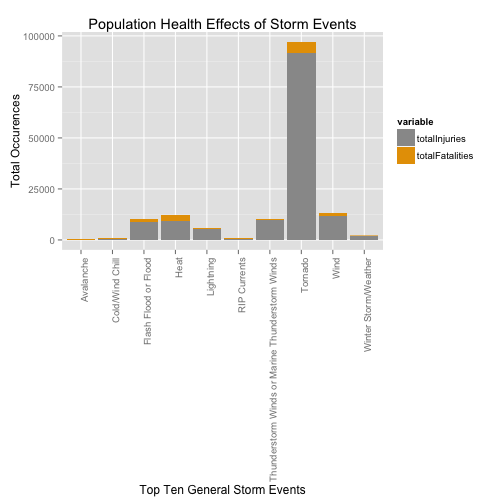
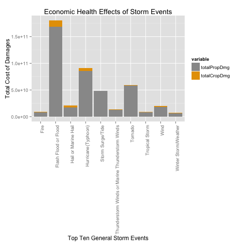

Storm Event Effects on Population and Economic Health
========================================================

## Synopsis
In this report, I aim to describe which storm events are the most damaging to population and economic health. My hypothesis is that tornadoes cause the most damages to both population and economic health. To investigate my hypothesis, I obtained data from the U.S. National Oceanic and Atmospheric Administration's (NOAA) storm database. This database tracks characteristics of major storms and weather events in the United States, including estimates of any fatalities, injuries, and property damages. From this data, we found that tornadoes are the most damaging to population health and flooding caused the most economic consequences.  

## Data Retrieval
From the [NOAA storm database](https://d396qusza40orc.cloudfront.net/repdata%2Fdata%2FStormData.csv.bz2), I obtained the compressed data for all major storms and weather events in the US reported to NOAA from 1950 to 2011. Once the data was downloaded, I uncompressed the data and saved it as `NOAA.data`.

```r
# Download File and Save Date Downloaded
NOAA.data.file <- download.file("https://d396qusza40orc.cloudfront.net/repdata%2Fdata%2FStormData.csv.bz2", 
    destfile = "StormData.csv.bz2", method = "curl")
dateDownloaded <- date()

# Unzip the bz2 archive
open.connection <- bzfile("StormData.csv.bz2", "r")
NOAA.data <- read.csv(open.connection)
close(open.connection)
unlink("StormData.csv.bz2")
```

## Data Processing
For the start of my data processing, I want to only keep the columns that pertain to population health and economic damages. Therefore, I want to keep the following columns in my data frame: "BGN_DATE","COUNTYNAME","STATE","EVTYPE","FATALITIES","INJURIES","PROPDMG","PROPDMGEXP","CROPDMG","CROPDMGEXP","REMARKS".

```r
# Subsetting the Data Frame to only include columns relevant for analysis
keeps <- c("BGN_DATE", "COUNTYNAME", "STATE", "EVTYPE", "FATALITIES", "INJURIES", 
    "PROPDMG", "PROPDMGEXP", "CROPDMG", "CROPDMGEXP", "REMARKS")
NOAA.data.keeps <- NOAA.data[, keeps]
```

Next, I want to keep only data that show fatalities, injuries, property damage, or crop damage.

```r
NOAA.data.with.damages <- subset(NOAA.data.keeps, NOAA.data.keeps$FATALITIES > 
    0 | NOAA.data.keeps$INJURIES > 0 | NOAA.data.keeps$PROPDMG > 0 | NOAA.data.keeps$CROPDMG > 
    0)
```

For the purpose of keeping formatting consistency, I am changing all `EVTYPE` to uppercase and removing all extra and un-necessary spaces.

```r
# Change all casing to upper
NOAA.data.with.damages$EVTYPE <- toupper(as.character(NOAA.data.with.damages$EVTYPE))
# Remove spaces from the front of EVTYPE
NOAA.data.with.damages$EVTYPE <- sub("^(\\s)+", "", NOAA.data.with.damages$EVTYPE)
# Remove extra spaces from EVTYPE
NOAA.data.with.damages$EVTYPE <- gsub("[[:space:]]+", " ", NOAA.data.with.damages$EVTYPE)
```

While reviewing the data, I noticed there were many naming inconsistencies and misspellings of the `EVTYPE`. Therefore, I corrected all data to have the same name conventions or spellings.

```r
# Renaming various mispellings of THUNDERSTORM
NOAA.data.with.damages$EVTYPE <- sub("(TSTM)|(THUDERSTORM)|(TUNDERSTORM)|(THUNDERSTROM)|(THUNDERTORM)|(THUNERSTORM)|(THUNDEERSTORM)|(THUNDERESTORM)", 
    "THUNDERSTORM", NOAA.data.with.damages$EVTYPE)
# Renaming TORNDAO as TORNADO
NOAA.data.with.damages$EVTYPE <- sub("TORNDAO", "TORNADO", NOAA.data.with.damages$EVTYPE)
# Renaming Avalance to Avalanche
NOAA.data.with.damages$EVTYPE <- sub("AVALANCE", "AVALANCHE", NOAA.data.with.damages$EVTYPE)
# Renaming MIRCO to MICRO
NOAA.data.with.damages$EVTYPE <- sub("MIRCO", "MICRO", NOAA.data.with.damages$EVTYPE)
# Renaming CSTL to COASTAL
NOAA.data.with.damages$EVTYPE <- sub("CSTL", "COASTAL", NOAA.data.with.damages$EVTYPE)
# Renaming WINDCHILL to WIND CHILL
NOAA.data.with.damages$EVTYPE <- sub("WINDCHILL", "WINDCHILL", NOAA.data.with.damages$EVTYPE)
# Renaming various misordering of FLASH FLOOD
NOAA.data.with.damages$EVTYPE <- sub("(FLOOD FLASH)|(FLOOD\\/FLASH)", "FLASH FLOOD", 
    NOAA.data.with.damages$EVTYPE)
# Renaming FLD to FLOOD
NOAA.data.with.damages$EVTYPE <- sub("FLD", "FLOOD", NOAA.data.with.damages$EVTYPE)
# Renaming LIGHTING to LIGHTNING
NOAA.data.with.damages$EVTYPE <- sub("LIGHTING", "LIGHTNING", NOAA.data.with.damages$EVTYPE)
# Renaming FLOES to FLOWS
NOAA.data.with.damages$EVTYPE <- sub("FLOES", "FLOWS", NOAA.data.with.damages$EVTYPE)
# Renaming Non-Thunderstorm Wind to Wind
NOAA.data.with.damages$EVTYPE <- sub("(NON-THUNDERSTORM)|(NON THUNDERSTORM)", 
    "", NOAA.data.with.damages$EVTYPE)
```

Based off of the groups in the [FAQ](https://d396qusza40orc.cloudfront.net/repdata%2Fpeer2_doc%2FNCDC%20Storm%20Events-FAQ%20Page.pdf), I created groups using subsets on `EVTYPE` to have a more general set of events for better analysis. For a few of the events, I needed to look them up in [Wikipedia](https://www.wikipedia.org/) or review the `REMARKS` column in the data to better idea of which group the event would fall into. For example, `Apache County` was listed as an `EVTYPE` so I reviewed the `REMARKS` and found that the event was related to thunderstorm winds.Several events fell under multiple groups and I let those events be counted under each group. For example, `Thunderstorm Wind` can be listed with `Thunderstorm` and `Wind`. After sub-setting into groups, I combined the groups back together under `NOAA.data.categorized`.

```r
# Create Subset for Tide or Storm Surge Storm Events
NOAA.data.tides <- NOAA.data.with.damages[grepl("(tide)|(surge)", NOAA.data.with.damages$EVTYPE, 
    ignore.case = TRUE), ]
NOAA.data.tides$General.Storm.Event <- "Storm Surge/Tide"

# Create Subset for Avalanche Storm Events
NOAA.data.avalanche <- NOAA.data.with.damages[grepl("avalanche", NOAA.data.with.damages$EVTYPE, 
    ignore.case = TRUE), ]
NOAA.data.avalanche$General.Storm.Event <- "Avalanche"

# Create Subset for Blizzard Storm Events
NOAA.data.blizzard <- NOAA.data.with.damages[grepl("blizzard", NOAA.data.with.damages$EVTYPE, 
    ignore.case = TRUE), ]
NOAA.data.blizzard$General.Storm.Event <- "Blizzard"

# Create Subset for Coastal Storm Events
NOAA.data.coastal <- NOAA.data.with.damages[grepl("(coastal)|(beach) ", NOAA.data.with.damages$EVTYPE, 
    ignore.case = TRUE), ]
NOAA.data.coastal$General.Storm.Event <- "Coastal"

# Create Subset for Cold or Wind Chill Storm Events
NOAA.data.cold.windchill <- NOAA.data.with.damages[grepl("(cold)|(wind chill)|(hypothermia)|(low temperature)", 
    NOAA.data.with.damages$EVTYPE, ignore.case = TRUE), ]
NOAA.data.cold.windchill$General.Storm.Event <- "Cold/Wind Chill"

# Create Subset for Debris Flow Storm Events
NOAA.data.debrisflow <- NOAA.data.with.damages[grepl("(slide)|(flows)|(slump)", 
    NOAA.data.with.damages$EVTYPE, ignore.case = TRUE), ]
NOAA.data.debrisflow$General.Storm.Event <- "Debris Flow"

# Create Subset for Dense Fog Storm Events
NOAA.data.densefogsmoke <- NOAA.data.with.damages[grepl("(fog)|(smoke)", NOAA.data.with.damages$EVTYPE, 
    ignore.case = TRUE), ]
NOAA.data.densefogsmoke$General.Storm.Event <- "Dense Fog or Freezing Fog or Dense Smoke"

# Create Subset for Drought Storm Events
NOAA.data.drought <- NOAA.data.with.damages[grepl("(drought)", NOAA.data.with.damages$EVTYPE, 
    ignore.case = TRUE), ]
NOAA.data.drought$General.Storm.Event <- "Drought"

# Create Subset for Dust Storm Events
NOAA.data.duststorm <- NOAA.data.with.damages[grepl("(dust devil)|(dust storm)|(dust)", 
    NOAA.data.with.damages$EVTYPE, ignore.case = TRUE), ]
NOAA.data.duststorm$General.Storm.Event <- "Dust Devil or Dust Storm"

# Create Subset for Heat Storm Events
NOAA.data.heat <- NOAA.data.with.damages[grepl("(heat)|(hyperthermia)|(warm)", 
    NOAA.data.with.damages$EVTYPE, ignore.case = TRUE), ]
NOAA.data.heat$General.Storm.Event <- "Heat"

# Create Subset for Flood Storm Events
NOAA.data.flood <- NOAA.data.with.damages[grepl("(flood)|(high water)|(rapidly rising water)", 
    NOAA.data.with.damages$EVTYPE, ignore.case = TRUE), ]
NOAA.data.flood$General.Storm.Event <- "Flash Flood or Flood"

# Create Subset for Frost/Freeze Storm Events
NOAA.data.frost <- NOAA.data.with.damages[grepl("(frost)|(freeze)", NOAA.data.with.damages$EVTYPE, 
    ignore.case = TRUE), ]
NOAA.data.frost$General.Storm.Event <- "Frost/Freeze"

# Create Subset for Funnel Cloud Storm Events
NOAA.data.funnel <- NOAA.data.with.damages[grepl("(funnel)", NOAA.data.with.damages$EVTYPE, 
    ignore.case = TRUE), ]
NOAA.data.funnel$General.Storm.Event <- "Funnel Cloud"

# Create Subset for Hail Storm Events
NOAA.data.hail <- NOAA.data.with.damages[grepl("(hail)", NOAA.data.with.damages$EVTYPE, 
    ignore.case = TRUE), ]
NOAA.data.hail$General.Storm.Event <- "Hail or Marine Hail"

# Create Subset for Thunderstorm Storm Events
NOAA.data.thunderstorm <- NOAA.data.with.damages[grepl("(thunderstorm)|(thundersnow)|(gustnado)|(apache)", 
    NOAA.data.with.damages$EVTYPE, ignore.case = TRUE), ]
NOAA.data.thunderstorm$General.Storm.Event <- "Thunderstorm Winds or Marine Thunderstorm Winds"

# Create Subset for Tornado Storm Events
NOAA.data.tornado <- NOAA.data.with.damages[grepl("(tornado)|(landspout)|(waterspout)", 
    NOAA.data.with.damages$EVTYPE, ignore.case = TRUE), ]
NOAA.data.tornado$General.Storm.Event <- "Tornado"

# Create Subset for Wind Storm Events
NOAA.data.wind <- NOAA.data.with.damages[grepl("(wind)|(microburst)|(downburst)|(whirlwind)|(turbulence)|(marine mishap)", 
    NOAA.data.with.damages$EVTYPE, ignore.case = TRUE), ]
NOAA.data.wind <- rbind(NOAA.data.wind, {
    subset(NOAA.data.with.damages, NOAA.data.with.damages$EVTYPE == "HIGH")
})
NOAA.data.wind$General.Storm.Event <- "Wind"

# Create Subset for Rain Storm Events
NOAA.data.rain <- NOAA.data.with.damages[grepl("(rain)|(shower)|(wet)", NOAA.data.with.damages$EVTYPE, 
    ignore.case = TRUE), ]
NOAA.data.rain$General.Storm.Event <- "Rain"

# Create Subset for Snow Storm Events
NOAA.data.snow <- NOAA.data.with.damages[grepl("(snow)", NOAA.data.with.damages$EVTYPE, 
    ignore.case = TRUE), ]
NOAA.data.snow$General.Storm.Event <- "Snow"

# Create Subset for Surf Storm Events
NOAA.data.surf <- NOAA.data.with.damages[grepl("(surf)|(swells)", NOAA.data.with.damages$EVTYPE, 
    ignore.case = TRUE), ]
NOAA.data.surf$General.Storm.Event <- "Surf"

# Create Subset for Hurricane(Typhoon) Storm Events
NOAA.data.hurricane <- NOAA.data.with.damages[grepl("(hurricane)|(typhoon)", 
    NOAA.data.with.damages$EVTYPE, ignore.case = TRUE), ]
NOAA.data.hurricane$General.Storm.Event <- "Hurricane(Typhoon)"

# Create Subset for Lightning Storm Events
NOAA.data.lightning <- NOAA.data.with.damages[grepl("(lightning)", NOAA.data.with.damages$EVTYPE, 
    ignore.case = TRUE), ]
NOAA.data.lightning$General.Storm.Event <- "Lightning"

# Create Subset for Ice Storm Events
NOAA.data.ice <- NOAA.data.with.damages[grepl("(ice)|(icy)|(glaze)", NOAA.data.with.damages$EVTYPE, 
    ignore.case = TRUE), ]
NOAA.data.ice$General.Storm.Event <- "Ice"

# Create Subset for Tropical Depression Storm Events
NOAA.data.tropicaldepression <- NOAA.data.with.damages[grepl("(tropical depression)", 
    NOAA.data.with.damages$EVTYPE, ignore.case = TRUE), ]
NOAA.data.tropicaldepression$General.Storm.Event <- "Tropical Depression"

# Create Subset for Tropical Storm Events
NOAA.data.tropicalstorm <- NOAA.data.with.damages[grepl("(tropical storm)", 
    NOAA.data.with.damages$EVTYPE, ignore.case = TRUE), ]
NOAA.data.tropicalstorm$General.Storm.Event <- "Tropical Storm"

# Create Subset for Winter Storm/Weather Storm Events
NOAA.data.winter <- NOAA.data.with.damages[grepl("(winter storm)|(winter weather)|(wintry))", 
    NOAA.data.with.damages$EVTYPE, ignore.case = TRUE), ]
NOAA.data.winter$General.Storm.Event <- "Winter Storm/Weather"

# Create Subset for Different Fire Storm Events
NOAA.data.fire <- NOAA.data.with.damages[grepl("(fire)", NOAA.data.with.damages$EVTYPE, 
    ignore.case = TRUE), ]
NOAA.data.fire$General.Storm.Event <- "Fire"

# Create Subset for Seiche Storm Events
NOAA.data.seiche <- NOAA.data.with.damages[grepl("(seiche)|(wave)|(high seas)|(heavy seas)|(rough seas)|(marine accident)", 
    NOAA.data.with.damages$EVTYPE, ignore.case = TRUE), ]
NOAA.data.seiche$General.Storm.Event <- "Seiche"

# Create Subset for Volcanic Ash Storm Events
NOAA.data.volcanicash <- NOAA.data.with.damages[grepl("(volcanic)", NOAA.data.with.damages$EVTYPE, 
    ignore.case = TRUE), ]
NOAA.data.volcanicash$General.Storm.Event <- "Volcanic Ash"

# Create Subset for Mix Precipitation Storm Events
NOAA.data.mixprecip <- NOAA.data.with.damages[grepl("(freezing drizzle)|(freezing spray)|(mix)|(precipitation)|(sleet)", 
    NOAA.data.with.damages$EVTYPE, ignore.case = TRUE), ]
NOAA.data.mixprecip$General.Storm.Event <- "Mixed Precipitation"

# Create Subset for RIP Current Storm Events
NOAA.data.ripcurrent <- NOAA.data.with.damages[grepl("(rip current)", NOAA.data.with.damages$EVTYPE, 
    ignore.case = TRUE), ]
NOAA.data.ripcurrent$General.Storm.Event <- "RIP Currents"

# Create Subset for Tsunami Storm Events
NOAA.data.tsunami <- NOAA.data.with.damages[grepl("(tsunami)", NOAA.data.with.damages$EVTYPE, 
    ignore.case = TRUE), ]
NOAA.data.tsunami$General.Storm.Event <- "Tsunami"

# Create Subset for Other Storm Events
NOAA.data.other <- NOAA.data.with.damages[grepl("(other)|(dam)|(drown)", NOAA.data.with.damages$EVTYPE, 
    ignore.case = TRUE), ]
NOAA.data.dust <- NOAA.data.other[grepl("dust", NOAA.data.other$REMARKS, ignore.case = TRUE), 
    ]
NOAA.data.dust$General.Storm.Event <- "Dust Devil or Dust Storm"
NOAA.data.rainother <- NOAA.data.other[grepl("rain", NOAA.data.other$REMARKS, 
    ignore.case = TRUE), ]
NOAA.data.rainother$General.Storm.Event <- "Rain"
NOAA.data.windother <- NOAA.data.other[grepl("wind", NOAA.data.other$REMARKS, 
    ignore.case = TRUE), ]
NOAA.data.windother$General.Storm.Event <- "Wind"
NOAA.data.other$General.Storm.Event <- "Other"

# Combine all the subsets into one overall dataframe
NOAA.data.categorized <- rbind(NOAA.data.tides, NOAA.data.avalanche, NOAA.data.blizzard, 
    NOAA.data.coastal, NOAA.data.cold.windchill, NOAA.data.debrisflow, NOAA.data.densefogsmoke, 
    NOAA.data.drought, NOAA.data.duststorm, NOAA.data.dust, NOAA.data.heat, 
    NOAA.data.flood, NOAA.data.frost, NOAA.data.funnel, NOAA.data.hail, NOAA.data.thunderstorm, 
    NOAA.data.tornado, NOAA.data.wind, NOAA.data.rain, NOAA.data.rainother, 
    NOAA.data.snow, NOAA.data.surf, NOAA.data.hurricane, NOAA.data.lightning, 
    NOAA.data.ice, NOAA.data.tropicaldepression, NOAA.data.tropicalstorm, NOAA.data.winter, 
    NOAA.data.fire, NOAA.data.seiche, NOAA.data.volcanicash, NOAA.data.mixprecip, 
    NOAA.data.ripcurrent, NOAA.data.tsunami, NOAA.data.windother)
```

 
## Results
### Population Health
After grouping all the data, I decided to build a overall summary of the total fatalities and injuries per group.

```r
library(plyr)
NOAA.data.health.summary <- ddply(NOAA.data.categorized, ~General.Storm.Event, 
    summarize, totalFatalities = sum(FATALITIES, na.rm = TRUE), totalInjuries = sum(INJURIES, 
        na.rm = TRUE))
NOAA.data.health.summary <- NOAA.data.health.summary[order(-NOAA.data.health.summary$totalFatalities, 
    -NOAA.data.health.summary$totalInjuries), ]

NOAA.data.health.summary
```

```
##                                General.Storm.Event totalFatalities
## 26                                         Tornado            5664
## 14                                            Heat            3179
## 10                            Flash Flood or Flood            1557
## 31                                            Wind            1462
## 17                                       Lightning             817
## 25 Thunderstorm Winds or Marine Thunderstorm Winds             756
## 20                                    RIP Currents             577
## 4                                  Cold/Wind Chill             466
## 32                            Winter Storm/Weather             278
## 1                                        Avalanche             225
## 21                                          Seiche             202
## 22                                            Snow             169
## 24                                            Surf             167
## 15                              Hurricane(Typhoon)             135
## 19                                            Rain             115
## 16                                             Ice             114
## 2                                         Blizzard             101
## 9                                             Fire              90
## 6         Dense Fog or Freezing Fog or Dense Smoke              81
## 28                                  Tropical Storm              66
## 13                             Hail or Marine Hail              45
## 5                                      Debris Flow              44
## 18                             Mixed Precipitation              36
## 29                                         Tsunami              33
## 8                         Dust Devil or Dust Storm              24
## 23                                Storm Surge/Tide              24
## 3                                          Coastal              10
## 7                                          Drought               6
## 11                                    Frost/Freeze               2
## 12                                    Funnel Cloud               0
## 27                             Tropical Depression               0
## 30                                    Volcanic Ash               0
##    totalInjuries
## 26         91436
## 14          9243
## 10          8683
## 31         11539
## 17          5232
## 25          9544
## 20           529
## 4            320
## 32          1891
## 1            171
## 21           411
## 22          1166
## 24           248
## 15          1333
## 19           307
## 16          2413
## 2            806
## 9           1608
## 6           1077
## 28           383
## 13          1467
## 5             55
## 18           258
## 29           129
## 8            487
## 23            43
## 3              9
## 7             19
## 11             3
## 12             3
## 27             0
## 30             0
```

From the above summary, I can see that we can really just focus on the top ten general storm events to know which storm event effects population health the most.Since after the top ten, the total fatalities drastically starts to decrease.

```r
library(ggplot2)
library(reshape2)
cbPalette <- c("#999999", "#E69F00", "#56B4E9", "#009E73", "#F0E442", "#0072B2", 
    "#D55E00", "#CC79A7")
print({
    standard.plot <- ggplot(melt(NOAA.data.health.summary[1:10, ], id.vars = "General.Storm.Event", 
        measure.vars = c("totalInjuries", "totalFatalities")), aes(General.Storm.Event, 
        value, fill = variable))
    plot.level.one <- standard.plot + geom_bar(stat = "identity") + scale_fill_manual(values = cbPalette)
    plot.level.two <- plot.level.one + labs(title = "Population Health Effects of Storm Events")
    plot.level.three <- plot.level.two + labs(x = "Top Ten General Storm Events", 
        y = "Total Occurences")
    plot.level.three + theme(axis.text.x = element_text(angle = 90, hjust = 1))
})
```

 

From the plot above, we can see that Tornado type events have the most devastating effect on population health.
### Economic Consequences
For economic consequences, I noticed I first needed to have numeric representation of the `*DMGEXP` in order to calculate the costs. Therefore, I added a column to the data frame that mapped the `*DMGEXP` to its corresponding exponential value.

```r
# Add column for Property Damage True Cost and True Exponent Value
levels(NOAA.data.with.damages$PROPDMGEXP)
```

```
##  [1] ""  "-" "?" "+" "0" "1" "2" "3" "4" "5" "6" "7" "8" "B" "h" "H" "K"
## [18] "m" "M"
```

```r
map_column <- rep(c(1, 1, 1, 1, 1, 10, 100, 1000, 10000, 1e+05, 1e+06, 1e+07, 
    1e+08, 1e+09, 100, 100, 1000, 1e+06, 1e+06))
NOAA.data.categorized$PROPDMGEXPVAL <- map_column[NOAA.data.categorized$PROPDMGEXP]

# Add column for Crop Damage True Cost and True Exponent Value
levels(NOAA.data.with.damages$CROPDMGEXP)
```

```
## [1] ""  "?" "0" "2" "B" "k" "K" "m" "M"
```

```r
map_column <- rep(c(1, 1, 1, 100, 1e+09, 1000, 1000, 1e+06, 1e+06))
NOAA.data.categorized$CROPDMGEXPVAL <- map_column[NOAA.data.categorized$CROPDMGEXP]
```

After adding the column for the exponential value, I calculated the cost for property and crop damages.

```r
# Add column for Property Damage Cost
NOAA.data.categorized$PROPDMGCOST <- NOAA.data.categorized$PROPDMG * NOAA.data.categorized$PROPDMGEXPVAL

# Add column for Crop Damage Cost
NOAA.data.categorized$CROPDMGCOST <- NOAA.data.categorized$CROPDMG * NOAA.data.categorized$CROPDMGEXPVAL
```

After grouping all the data, I decided to build a overall summary of the total property and crop damages per group.

```r
library(plyr)
NOAA.data.economic.summary <- ddply(NOAA.data.categorized, ~General.Storm.Event, 
    summarize, totalPropDmg = sum(PROPDMGCOST, na.rm = TRUE), totalCropDmg = sum(CROPDMGCOST, 
        na.rm = TRUE))
NOAA.data.economic.summary <- NOAA.data.economic.summary[order(-NOAA.data.economic.summary$totalPropDmg, 
    -NOAA.data.economic.summary$totalCropDmg), ]
NOAA.data.economic.summary
```

```
##                                General.Storm.Event totalPropDmg
## 10                            Flash Flood or Flood    1.683e+11
## 15                              Hurricane(Typhoon)    8.536e+10
## 26                                         Tornado    5.861e+10
## 23                                Storm Surge/Tide    4.797e+10
## 31                                            Wind    1.796e+10
## 13                             Hail or Marine Hail    1.762e+10
## 25 Thunderstorm Winds or Marine Thunderstorm Winds    1.279e+10
## 9                                             Fire    8.502e+09
## 28                                  Tropical Storm    7.714e+09
## 32                            Winter Storm/Weather    6.777e+09
## 16                                             Ice    3.975e+09
## 19                                            Rain    3.271e+09
## 7                                          Drought    1.046e+09
## 22                                            Snow    1.033e+09
## 17                                       Lightning    9.407e+08
## 2                                         Blizzard    6.649e+08
## 3                                          Coastal    4.502e+08
## 5                                      Debris Flow    3.276e+08
## 4                                  Cold/Wind Chill    2.466e+08
## 29                                         Tsunami    1.441e+08
## 24                                            Surf    1.151e+08
## 6         Dense Fog or Freezing Fog or Dense Smoke    2.511e+07
## 14                                            Heat    2.033e+07
## 11                                    Frost/Freeze    1.920e+07
## 21                                          Seiche    1.271e+07
## 18                             Mixed Precipitation    1.118e+07
## 1                                        Avalanche    8.722e+06
## 8                         Dust Devil or Dust Storm    6.344e+06
## 27                             Tropical Depression    1.737e+06
## 30                                    Volcanic Ash    5.000e+05
## 12                                    Funnel Cloud    1.996e+05
## 20                                    RIP Currents    1.630e+05
##    totalCropDmg
## 10    1.239e+10
## 15    5.516e+09
## 26    4.175e+08
## 23    8.550e+05
## 31    2.159e+09
## 13    3.114e+09
## 25    1.274e+09
## 9     4.033e+08
## 28    6.949e+08
## 32    4.744e+07
## 16    5.027e+09
## 19    1.133e+09
## 7     1.397e+10
## 22    1.347e+08
## 17    1.210e+07
## 2     1.121e+08
## 3     5.600e+04
## 5     2.002e+07
## 4     1.417e+09
## 29    2.000e+04
## 24    1.500e+06
## 6     0.000e+00
## 14    9.045e+08
## 11    1.997e+09
## 21    5.600e+06
## 18    0.000e+00
## 1     0.000e+00
## 8     3.650e+06
## 27    0.000e+00
## 30    0.000e+00
## 12    0.000e+00
## 20    0.000e+00
```

From the above summary, I can see that we can really just focus on the top ten general storm events to know which storm event causes the most economic consequences. Since after the top ten, the damage costs drastically starts to decrease.

```r
library(ggplot2)
library(reshape2)
cbPalette <- c("#999999", "#E69F00", "#56B4E9", "#009E73", "#F0E442", "#0072B2", 
    "#D55E00", "#CC79A7")
print({
    standard.plot <- ggplot(melt(NOAA.data.economic.summary[1:10, ], id.vars = "General.Storm.Event", 
        measure.vars = c("totalPropDmg", "totalCropDmg")), aes(General.Storm.Event, 
        value, fill = variable))
    plot.level.one <- standard.plot + geom_bar(stat = "identity") + scale_fill_manual(values = cbPalette)
    plot.level.two <- plot.level.one + labs(title = "Economic Health Effects of Storm Events")
    plot.level.three <- plot.level.two + labs(x = "Top Ten General Storm Events", 
        y = "Total Cost of Damages")
    plot.level.three + theme(axis.text.x = element_text(angle = 90, hjust = 1))
})
```

 

From the plot above, we can see that Flood type events has the most economic consequences.
